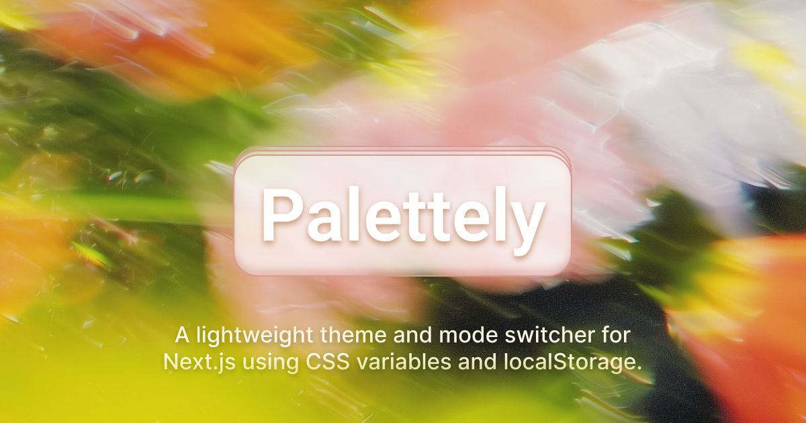

# Palettely

Flexible theme and color mode system for modern Next.js apps. Simple logic. Full UI control. Style your way.

---

## Features

- Multiple color themes (`default`, `purple`, `green`, etc.)
- Light and dark modes toggle
- Persistent user preference saved in `localStorage`
- Smooth hydration-aware UI to prevent flicker
- Fully extensible — add your own themes and customize styles
- Built with TypeScript for type safety
- Uses [Shadcn UI](https://ui.shadcn.com/) Tabs and icons for a polished interface
- Simple CSS variable theming with `[data-theme][data-mode]` selectors

---

## Usage

### Wrap your app with the `ThemeProvider`

```tsx
import { ThemeProvider } from "./context/theme-context";

export default function App({ children }: { children: React.ReactNode }) {
  return <ThemeProvider>{children}</ThemeProvider>;
}
```

---

### Use the `useThemeContext` hook in your components

```tsx
import { useThemeContext } from "./context/theme-context";

export function ThemeSwitcher() {
  const { theme, mode, setTheme, setMode, hydrated } = useThemeContext();

  if (!hydrated) {
    return null; // Prevent hydration mismatch; animation handles fade-in
  }

  return (
    // Your UI code here (e.g., Tabs from shadcn/ui)
  );
}
```

---

### Core theme switching logic

- On mount, `ThemeProvider` reads theme/mode from `localStorage` or falls back to defaults
- It sets `[data-theme]` and `[data-mode]` attributes on `<html>` for CSS variables
- Updates to theme/mode update localStorage and HTML attributes
- `hydrated` flag prevents UI rendering before client hydration to avoid flicker
- You can customize the UI with Shadcn Tabs or your preferred components

---

### Theme script for SSR / first paint optimization

You can add this script in your root HTML to apply theme/mode immediately on page load, reducing flicker:

```tsx
export const ThemeScript = () => {
  const code = `
    (function() {
      try {
        const theme = localStorage.getItem('theme') || 'default';
        const mode = localStorage.getItem('mode') || 'light';
        document.documentElement.setAttribute('data-theme', theme);
        document.documentElement.setAttribute('data-mode', mode);
      } catch (_) {}
    })();
  `;
  return <script dangerouslySetInnerHTML={{ __html: code }} />;
};
```

Add `<ThemeScript />` at the top of your app or in your custom Document if using Next.js.

---

## Adding Your Own Theme

### 1. Update theme types

In your `theme-context.tsx`:

```ts
type Theme = "default" | "purple" | "green" | "myNewTheme";
```

---

### 2. Add CSS variables for your theme

Use `[data-theme][data-mode]` attribute selectors to scope variables:

```css
/* ===============================
   My New Theme - Light Mode
================================= */
[data-theme="myNewTheme"][data-mode="light"] {
  --background: oklch(0.95 0.02 120);
  --foreground: oklch(0.35 0.1 110);
  /* Add your CSS variables here */
}

/* My New Theme - Dark Mode */
[data-theme="myNewTheme"][data-mode="dark"] {
  --background: oklch(0.15 0.02 120);
  --foreground: oklch(0.8 0.1 110);
}
```

---

### 3. Add UI option for your theme

In your theme switcher component, add a new tab trigger:

```tsx
<TabsTrigger value="myNewTheme" onClick={() => setTheme("myNewTheme")}>
  My New Theme
</TabsTrigger>
```

---

### 4. Customize the UI as needed

Feel free to modify the UI switching components (`Tabs`, `TabsTrigger`, icons) to fit your design needs. The logic and state management are already handled by the context.

---

## How it works under the hood

- **Context**: Provides current theme and mode, plus setters and hydration state
- **LocalStorage**: Persists theme/mode across sessions
- **HTML attributes**: `[data-theme]` and `[data-mode]` enable scoped CSS variables
- **Hydration handling**: `hydrated` flag avoids UI render mismatch; fallback `return null;` used before hydration
- **Animation**: Motion animation fades the switcher in smoothly after hydration to improve UX
- **UI Components**: Built with Shadcn UI Tabs and Lucide Icons for a clean and accessible control

---

## Contributing

Contributions and suggestions are welcome! Feel free to open an issue or submit a PR.

---

## License

MIT © Brahim Boussada
